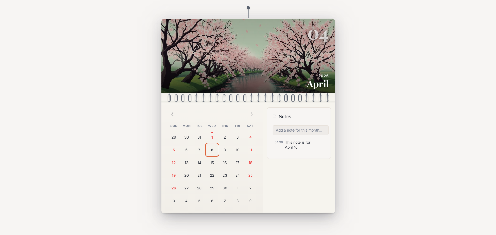
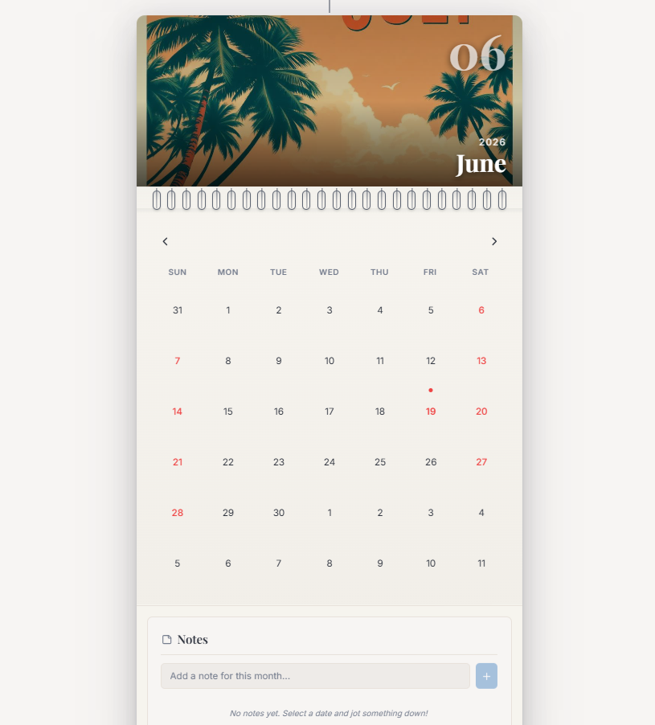
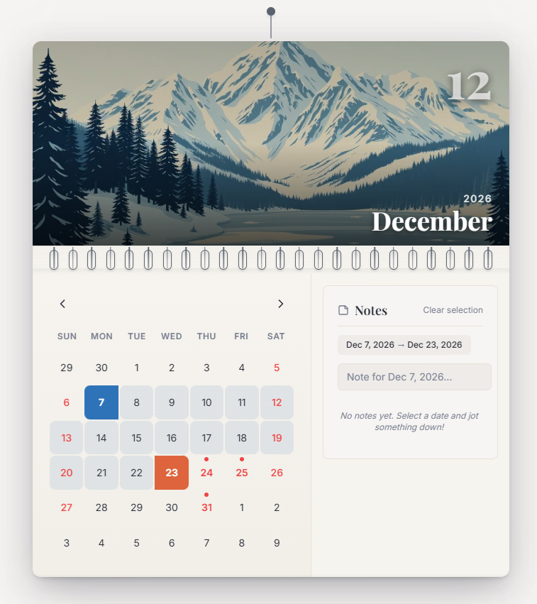
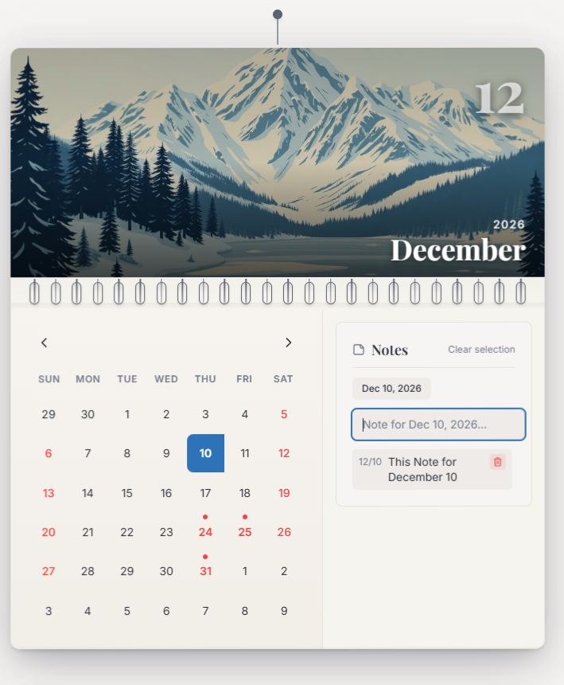
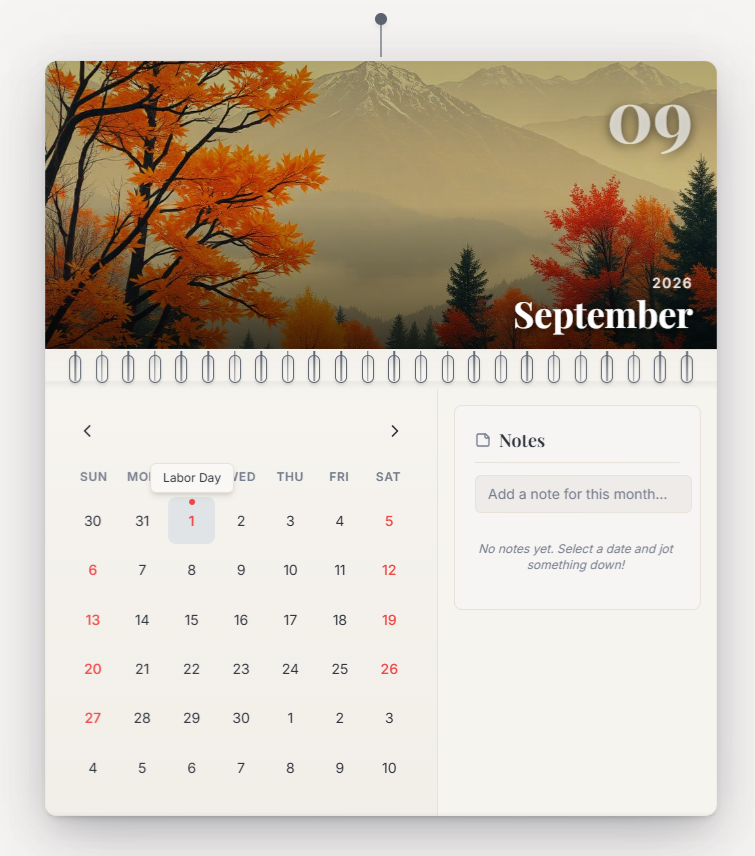

# Interactive Wall Calendar Component

A polished, interactive React calendar component inspired by a physical wall calendar. This project demonstrates a clean UI, smooth UX, and a fully responsive design with advanced features like day range selection, notes, and climate-based background imagery.

[Deployed Link](https://cal-eight-khaki.vercel.app/)

---

## Features

- **Wall Calendar Aesthetic**: Modern UI inspired by a physical wall calendar with a hero image at the top.  
- **Day Range Selector**: Select a start and end date, with clear visual states for the range.  
- **Integrated Notes Section**: Add notes for any specific date or date range, instantly reflected in the UI.  
- **Responsive Design**: Optimized for desktop and mobile layouts.  
- **Climate-based Backgrounds**: Background images change based on the month/season (e.g., January & December = winter imagery).  
- **Animations & UX Polishing**: Subtle flipping animations for selected dates and smooth interactions.  
- **Extensible Folder Structure** for maintainable code.

---

## Project Structure
```bash
src/
├─ components/
│ ├─ calendar/
│ │ ├─ CalendarGrid.tsx
│ │ ├─ CalendarImage.tsx
│ │ ├─ DayCell.tsx
│ │ ├─ HangingCalendar.tsx
│ │ ├─ NotesPanel.tsx
│ │ └─ WireBinding.tsx
│ ├─ ui/
│ └─ NavLink.tsx
├─ hooks/
│ ├─ useCalendar.ts
│ ├─ use-mobile.tsx
│ └─ use-toast.ts
├─ lib/
│ ├─ calendar-utils.ts
│ ├─ month-images.ts
│ └─ utils.ts
├─ pages/
│ ├─ Index.tsx
│ └─ NotFound.tsx
├─ assets/
├─ App.tsx
├─ main.tsx
└─ styles/
```

---

## Installation

1. Clone the repository:

```bash
git clone https://github.com/Himanshuu23/cal.git
cd cal
npm install
npm run dev
```
Open http://localhost:5173 to see the calendar in action.

---

## Usage
Select a start and end date on the calendar grid.
Click a date to add or view notes.
Background image automatically reflects the current month’s climate/season.
Works seamlessly on both desktop and mobile devices.

---

## Screenshots
**Desktop View** - Modern Design and Easy UX



**Responsive Mobile View**



**Date Range Selector** - Selecting range of date and also specific notes for that range



**Integrated Notes Section** - Can also delete and manage notes for each months separately



**Dynamic Background Images according to Season & Holidays Mentioned**



---

## Video Demonstration
[Demo Video](https://vimeo.com/1181238800?share=copy&fl=sv&fe=ci)

---

## Tech Stack
- React + TypeScript
- Vite
- Tailwind CSS
- PostCSS
- Custom Hooks & Component Architecture
